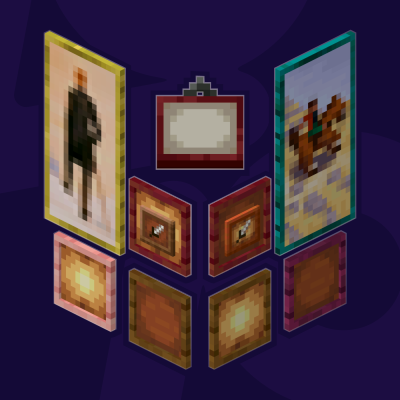

#  
&emsp;&emsp;&emsp; More Frame Variants  <a title="More Frame Variants on Curseforge" href="https://www.curseforge.com/minecraft/mc-mods/more-frame-variants"></a> 
  
>   
>  A mod adding wood variants for Minecraft's Painting and Item Frames.       
>  

<h5>Show in-game example image</h5>
  <!--CAPTION:PLACEHOLDER-->
  
   

###  Compatibility

<table>
  <thead>
    <tr>
      <td><strong>Minecraft</strong></td>
      <td>
        <a href="https://modrinth.com/mod/more-frame-variants/versions?g=1.20.1"><code>1.20.1</code></a> 
        <a href="https://modrinth.com/mod/more-frame-variants/versions?g=1.21&g=1.21.1"><code>1.21(.1)</code></a>, <a href="https://modrinth.com/mod/more-frame-variants/versions?g=1.21.4&g=1.21.5&g=1.21.6&g=1.21.7&g=1.21.8&g=1.21.9&g=1.21.10&g=1.21.11"><code>1.21.4</code>~<code>1.21.11</code></a> 
        <a href="https://modrinth.com/mod/more-frame-variants/versions?g=26.1"><code>26.1</code></a>
      </td>
    </tr>
  </thead>
  <tbody>
    <tr>
      <td><strong>Mod Loaders</strong></td>
      <td><a href="https://fabricmc.net/use/installer/"><code>Fabric Loader</code></a></td>
    </tr>
  </tbody>
  <thead>
    <tr>
      <td><strong>Requires</strong></td>
      <td>
        <a href="https://modrinth.com/mod/fabric-api"><code>Fabric API</code></a> <a href="https://modrinth.com/mod/more-stick-variants"><code>More Stick Variants (MStV)</code></a>
      </td>
    </tr>
  </thead>
  <tbody>
    <tr>
      <td><strong>Supports</strong></td>
      <td>
        <a href="https://modrinth.com/mod/fast-item-frames"><code>Fast Item Frames</code></a> <a href="https://modrinth.com/mod/dark-paintings"><code>Dark Paintings</code></a> <a href="https://modrinth.com/mod/nemos-paintings"><code>Nemoʼs Paintings</code></a> <a href="https://modrinth.com/mod/macaws-paintings"><code>Macaw's Paintings</code></a>
      </td>
    </tr>
  </tbody>
</table>
 

###  Translations

|Language|Translator|
|--|--|
|English||
|German||

> [!NOTE]
> > Want to help translate? If you can, please open a PR to the **default branch** [`1.21(.1)`](../../tree/1.21(.1)).  
> > Otherwise, simply send your translation via email (contact@pnku.de) or join the [Discord](https://discord.lieonlion.dev).

 

  

### Versions

<!--CHANGELOG:START-->

#### 1.2.6[*](#footnote-*):
- `26.1`: 
  - Update to <ins>26.1</ins>
  - Add _Cartographer_ and _Shepherd Villager_ trades for _Item Frame_ and _Painting_ variants respectively  
    > This was formerly a feature of <ins>More Stick Variants (MStV)</ins> (&#x200A;&#x200A;&#x200A;&#x200A;&#x200A;) but with Minecraft <ins>26.1</ins>, _Villager_ trading has become data-driven allowing for each _More Variants_ mod to implement this feature for their respective block/item variants without needing to rely on <ins>MStV</ins> (&#x200A;&#x200A;&#x200A;&#x200A;&#x200A;) for this functionality.

  
License update to [`CC-BY-NC-SA-4.0`](https://creativecommons.org/licenses/by-nc-sa/4.0/) (previously [`MIT`](https://choosealicense.com/licenses/mit))

<h2><ins>Download 1.2.6 + 1.21(.1)</ins>:&#x200A;
&#x200A;

</h2>

<!--CHANGELOG:END-->

> <strong>*</strong>: Most recent version  
> _`The version above is automatically updated with the newest release and only after it has been successfully published.`_

> [!TIP]
> > Looking for changes of previous versions?  
> > You can find them in the [changelog history](./CHANGELOG_history.md).

---
#### Support/Contact
- Suggestions? Questions? Bug reports?  
  Feel free to [open an issue](/../../issues)!  
  &nbsp;  
  You can also contact me via email at [contact@pnku.de](mailto:contact@pnku.de) or join the [Discord](https://dsc.lieonlion.dev) and contact me there.
